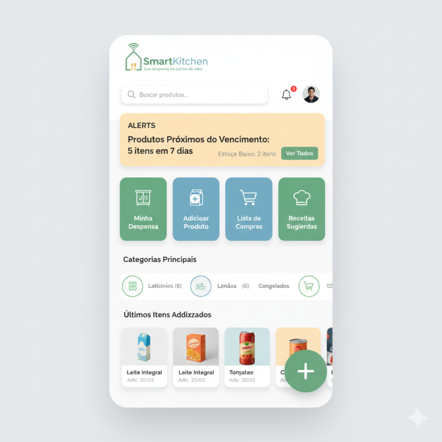

<p align="center">
  
</p>

# 🍳 SmartKitchen

## 📖 Visão Geral do Projeto

O **SmartKitchen** é uma aplicação para **gerenciamento de estoque residencial**.  
Com ele, você pode:

-   Controlar a entrada e saída de itens da despensa.
-   Receber alertas de produtos próximos do vencimento.
-   Organizar categorias de alimentos e itens.
-   Futuramente, até receber **sugestões de receitas** e **listas de compras inteligentes**.

O objetivo é ser uma ferramenta **simples, rápida e acessível de qualquer lugar**, servindo tanto para aprendizes quanto para devs experientes colocarem em prática conceitos modernos de desenvolvimento.

## 🔍 Preview

<p align="center">
  
</p>

---

## 🧭 Filosofia do Projeto

-   Implementação como **API RESTful** seguindo arquitetura **MVC**.
-   Projeto com domínio próprio.
-   Padrão de qualidade em código, testes e documentação.
-   Cultura de colaboração com PRs, Code Review e CI/CD.

---

## 🛠️ Tecnologias e Ferramentas

-   **JavaScript / Node.js v18 (Hydrogen)**
-   **Docker** (opcional para desenvolvimento local)
-   **PostgreSQL v16**
-   **Prettier, ESLint e EditorConfig** (padronização de estilo de código)
-   **Jest** (testes automatizados)
-   **GitHub Actions** (CI/CD)
-   **Vercel** (deploy serverless)

---

## 🚀 Funcionalidades (MVP)

-   Cadastro rápido de itens (nome, quantidade, validade, categoria).
-   Alertas automáticos para itens prestes a vencer ou acabar.
-   Categorias personalizáveis (tipo, marca, prateleira etc.).

---

## 💡 Funcionalidades Futuras

-   Sugestões de receitas baseadas nos itens do estoque.
-   Leitura de código de barras via câmera.
-   Integração com IA para cardápios semanais.
-   Lista de compras inteligente.
-   Assistente via WhatsApp.
-   Compartilhamento com membros da família.

---

## 🏗️ Arquitetura e Componentes

-   **Frontend:** em `pages/` (Next.js).
-   **API Layer:** em `pages/api/v1/` (endpoints de status, migrations etc.).
-   **Banco de Dados:** PostgreSQL (Docker Compose em `infra/compose.yaml`).
-   **Migrations:** via `node-pg-migrate`.
-   **Abstração de DB:** em `infra/database.js`.
-   **Scripts de Infra:** `infra/scripts/wait-for-postgres.js` garante que o banco esteja pronto antes dos testes/migrations.

---

## 👨‍💻 Fluxo de Desenvolvimento

### Iniciar ambiente local

```bash
npm run dev
```

-   Sobe os serviços via Docker.
-   Aguarda DB, aplica migrations.
-   Inicia o Next.js.

### Executar testes

```bash
npm test
```

-   Roda Jest em paralelo.

### Linting

```bash
npm run lint:prettier:check
npm run lint:eslint:check
```

### Migrations

```bash
npm run migrations:create   # criar migration
npm run migrations:up       # aplicar migration
```

### Serviços

```bash
npm run services:up     # iniciar
npm run services:stop   # parar
npm run services:down   # remover
```

---

## 📐 Convenções e Padrões

-   **API Methods:** apenas `GET` e `POST` para endpoint de migrations.
-   **Database:** sempre usar abstração em `infra/database.js`.
-   **Variáveis de ambiente:** `.env.development`.
-   **Commits:** padrão _Conventional Commits_ (Commitizen + Commitlint).
-   **CI/CD:** lint + testes rodam a cada PR.

---

## 🔗 Integrações

-   PostgreSQL (Docker)
-   Next.js
-   node-pg-migrate
-   Jest (testes)
-   Prettier, ESLint
-   Husky, Commitizen, Commitlint (git hooks)

---

## 📊 Exemplos

-   API de migrations: `pages/api/v1/migrations/index.js`
-   Conexão DB: `infra/database.js`
-   Script de readiness: `infra/scripts/wait-for-postgres.js`

---

## 📈 Fluxos Principais (exemplo de uso)

-   **Cadastro de item:** usuário adiciona um produto com validade e categoria → salva no DB.
-   **Alerta de vencimento:** sistema detecta produto próximo da data e gera notificação.
-   **Consumo de item:** usuário marca quantidade consumida → estoque atualizado.
-   **Relatório futuro (planejado):** gerar lista de compras automática com base nos itens em falta.

---

## 🤝 Como Contribuir

Quer ajudar no desenvolvimento?  
Confira as regras e fluxo no arquivo [docs/CONTRIBUTING.md](./docs/CONTRIBUTING.md).

-   Devs **juniors** e **seniors** participam do projeto.

---

## ✅ Checklist do README

-   [x] Visão geral e objetivos.
-   [x] Instruções de execução local.
-   [x] Deploy descrito (Vercel + GitHub Actions).
-   [x] Fluxos principais documentados.
-   [x] Critérios de contribuição e organização do time.

---

✨ Projeto desenvolvido no curso como laboratório de boas práticas em **desenvolvimento colaborativo**.
